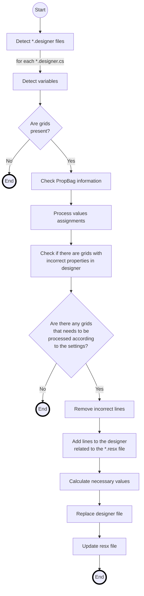

# Introduction

**True DB Grid** is a component that was originally developed by Apex for Visual Basic 6 (VB6) and then it became part of Component One. Newer versions were developed for .NET. This component is a Data Grid that allows many customizations for each of its parts.
A True DB Grid is made of **Splits** and **Data Columns** (Columns). A Split is a view of the Grid that shows a custom configuration for each column. This means that a grid can show the same columns multiple times, but each time can look different. A True DB Grid has one default Split. A Display Column is how a Column is seen in each Split.

There is also the possibility to use a column as an input with different options. Some allowed types of inputs are Radio Buttons, Combo Boxes and Check Boxes. Each option for these inputs are called **Value Items**.

The Grid itself, each Split and **Display Column** has some **Styles** used in different parts (SelectedStyle, HeadingStyle, Caption Style and more). These styles has some visual properties like Background Color, Foreground Color, Text Alignment and much more.

Visual Basic Upgrade Companion (VBUC) is a tool made by Mobilize.NET that is capable of upgrading projects made for VB6 to .NET.  VBUC offers the possibility of upgrading the VB6 version of True DB Grid to it's .NET counterpart. It's also capable of upgrading othe kinds of grids to True DB Grids.

# Migration details about True DB Grid

Some information of each True DB Grid in a .NET project is stored inside an specific XML called Property Bag. This XML is stored inside the .resx file of the WinForm as a string with escaped characters. These properties can also be set programatically by code. Properties related to Splits, Columns, Display Columns and Styles belong to the Property Bag. 
When VBUC migrates a VB6 True DB Grid v5 or v6, all the properties are set programatically in the designer file in the InitializeComponents() method of the form instead of being saved in the property bag in the .resx file. This can cause problems since Visual Studio will remove all those properties when the form editor is opened. This is the reason why this tool was made.

# How to use the tool

The `C1TrueDBGridPropBagGen` is very easy to use. The first thing to do is select a folder of the project that was migrated by the **VBUC**. The tool will automatically process every form included in this folder and subfolders. After that, make sure the correct settings are set like which forms should be processed.

By default, every form will be processed but you can decide if the tool should only process forms that exclusively have incorrect grid properties in the designer or grids that exclusively  have an existing property bag or only grids which both conditions are met.

If the tool is going to process forms with existing property bags for the grids, you must choose what to do with these existing property bags. By default, the tool is going to parse it and add new properties found. Another option is to and overwrite it with the properties found.

Some minor options are also included like disabling the output. This can improve the performance of the tool. The tool also includes the option to continue with the next form if an unhandled exception is thrown.

When the settings are ready, you must click in the Generate button and every form that uses True DB Grids will have their properties in their corresponding Property Bags. The console will output the name of the files being processed and the properties that are not being added to the property bag. 

# After the forms are processed

After the tool finishes, a log with a summary of the processed forms will be generated. Some forms may generate some missing  information when the editor is opened, however, the corresponding properties of the Splits, Columns and Display Columns are not going to be removed.

# How it works

![Diagram](https://mermaidjs.github.io/mermaid-live-editor/#/view/eyJjb2RlIjoiZ3JhcGggVERcbkEoKFN0YXJ0KSkgLS0-IEJbRGV0ZWN0ICouZGVzaWduZXIgZmlsZXNdXG5CIC0tIGZvciBlYWNoICouZGVzaWduZXIuY3MgLS0-IENbRGV0ZWN0IHZhcmlhYmxlc11cbkMgLS0-IER7QXJlIGdyaWRzPGJyLz5wcmVzZW50P31cbkQgLS0gTm8gLS0-IEUoKEVuZCkpXG5EIC0tIFllcyAtLT4gRltDaGVjayBQcm9wQmFnIGluZm9ybWF0aW9uXVxuRiAtLT4gR1tQcm9jZXNzIHZhbHVlcyBhc3NpZ25tZW50c11cbkcgLS0-IEhbQ2hlY2sgaWYgdGhlcmUgYXJlIGdyaWRzIHdpdGg8YnIvPmluY29ycmVjdCBwcm9wZXJ0aWVzIGluIGRlc2lnbmVyXVxuSCAtLT4gSXtBcmUgdGhlcmUgYW55IGdyaWRzPGJyLz50aGF0IG5lZWRzIHRvIGJlPGJyLz5wcm9jZXNzZWQgYWNjb3JkaW5nPGJyLz50byB0aGUgc2V0dGluZ3M_fVxuSSAtLSBObyAtLT4gSigoRW5kKSlcbkkgLS0gWWVzIC0tPiBLW1JlbW92ZSBpbmNvcnJlY3QgbGluZXNdXG5LIC0tPiBMW0FkZCBsaW5lcyB0byB0aGUgZGVzaWduZXI8YnIvPnJlbGF0ZWQgdG8gdGhlICoucmVzeCBmaWxlXVxuTCAtLT4gTVtDYWxjdWxhdGUgbmVjZXNzYXJ5IHZhbHVlc11cbk0gLS0-IE5bUmVwbGFjZSBkZXNpZ25lciBmaWxlXVxuTiAtLT4gT1tVcGRhdGUgcmVzeCBmaWxlXVxuTyAtLT4gUCgoRW5kKSlcbnN0eWxlIEUgc3Ryb2tlOiMwMDAsc3Ryb2tlLXdpZHRoOjRweFxuc3R5bGUgSiBzdHJva2U6IzAwMCxzdHJva2Utd2lkdGg6NHB4XG5zdHlsZSBQIHN0cm9rZTojMDAwLHN0cm9rZS13aWR0aDo0cHgiLCJtZXJtYWlkIjp7InRoZW1lIjoiZGVmYXVsdCJ9fQ)

The tool heavily uses Regular Expressions to read each line and detect the properties. It first detects all the designer files located inside the selected folder (and subfolders). After that, the tool will detect all the variables related to True DB Grids. This includes C1TrueDBGrid, C1TrueDBGridHelper,  C1DataColumn and ValueItem. During this process, the lines will be added to a List. If there are not grids found, the tool will continue with the next form.

After the variables are detected, the tool will check if there grids found have already a property bag in the .resx file. It will be parsed if it's necessary according the tool's settings.

The tool will create custom Regular Expressions according to the grid variables found and with them, it is going to determine which lines should be processed to check the value assignment of each property. When a line is being processed several Regular Expressions are going to be used to decompose the line to determine where the property belongs.

When the tool finished processing the lines, it will know if there are incorrect lines in the designer files. According to this information, it will check if there are still grids to process according to the tool's settings. Then, it will remove all the incorrect lines present in the designer file.

In the designer file, there should be a line of code that indicates the assignment of the property bag in the .resx file to the corresponding grid. The tool will make sure this line is inserted. Since it is not easy to determine where to insert this line, the tool will place it after the "SuspendLayout();" that is always present in the InitializeComponents() method.

Some values that are necessary in the property bag will be calculated or generated, like the indexes of each Display Column or the dimensions of each Split. When this is done, the tool will be ready to replace the designer and .resx files with the updated ones.

The tool will repeat this process for every form found in the selected folder.

# Details about the used regular expressions

Since most of the regular expressions are used several times, they are being precompiled and reused to get a better performance. Some of the regular expressions strings are only part of more complex regular expressions.

There is a different regular expression to check if a line is the declaration of True DB Grid, a Data Column or a Value Item. It first checks the access type to make sure it's a declaration, because VBUC always adds the access type explicitly. After that, it will check that the next group matches the name of one of the previously mentioned types. In the case of True DB Grids, it will also check if an Upgrade Helper is being used.

To check if a line should be processed, a customized regular expression is made, according to the grid variables found in the designer file. If the trimmed line matches this regular expression, it will be processed.

To process a line, the tool tries to separate it in different parts. Different classes called Property Readers are responsible of applying the necessary regular expressions to decompose the line. When the line is being read, a switch structure is used to check what to do, depending of what was read in each part of the line. The tool will save the property's value in memory (in a dictionary or in an object, depending on the property).

Other regular expressions are also used to decompose the value of certain properties and convert the value to a necessary format, like colors and font styles.